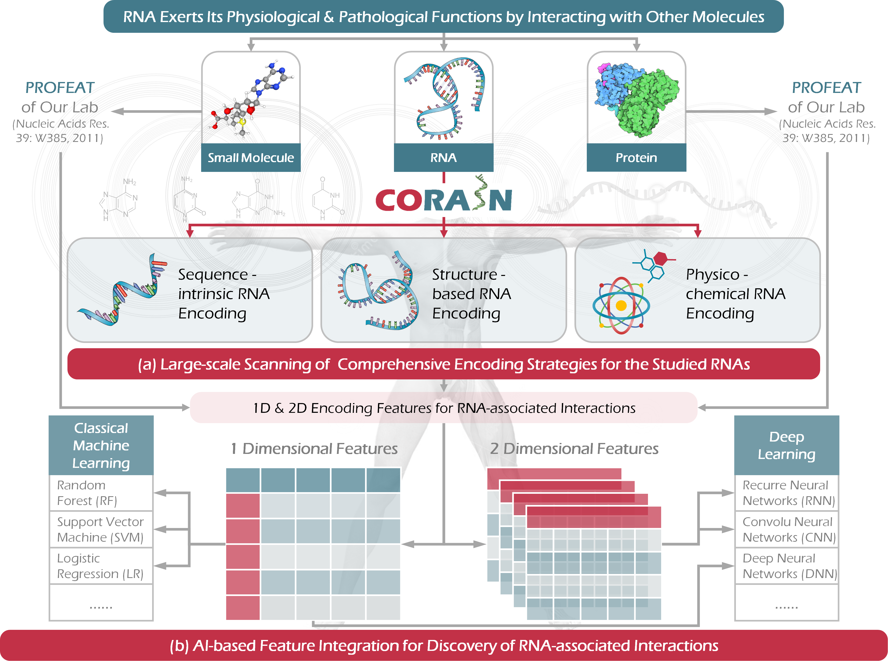
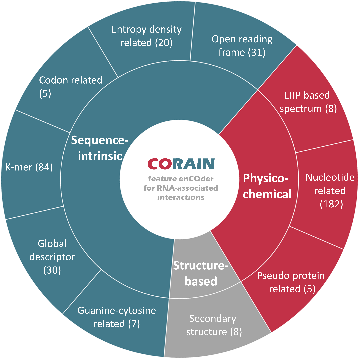

[](https://www.python.org/)


[](http://idrblab.org/corain/)
CORAIN is constructed to encode RNA of **(1) providing various coding strategies for RNA from three perspectives, sequence, structure and physical chemical properties, (2) offering the combined coding strategies of RNA-RNA interaction, RNA-protein interaction and RNA-drug interaction, (3) covering the encoding methods not only for conventional machine learning but also the deep learning**. Therefore, users can get the encoding results of RNA or the encoding results of RNA interaction pairs from CORAIN, which can be directly used for artificial intelligence.

# Contents
- [Contents](#contents)
- [Workflow](#workflow)
- [Requirements and installment](#requirements-and-installment)
- [Basic usage](#basic-usage)
- [Study demo](#study-demo)
  - [1. RNA-only](#1-rna-only)
  - [2. RNA-RNA interaction](#2-rna-rna-interaction)
  - [3. RNA-protein interaction](#3-rna-protein-interaction)
  - [4. RNA-compound interaction](#4-rna-compound-interaction)
- [Question && issue](#question--issue)

# Workflow

CORAIN coding and combined feature evaluation are divided into two parts. Step 1: Encode the uploaded RNA and RNA-interacting molecules (RNA, protein, small molecule compounds) to obtain one-dimensional or two-dimensional coding features; Step 2: If one-dimensional coding features are performed, and the sample type If it is greater than or equal to 2, then the combined feature evaluation process can be performed. 

# Requirements and installment
This software is developed with Python 3.X, Python 3.X is required as runtime environment. we recommemd user to install [anaconda3](https://www.anaconda.com/) which is well-known as a scientific Python.

```shell
git clone https://github.com/wangyx/corain
cd corain
# virtual environment are recommended
conda create -n corain python=3.8
pip install -r requirements.txt
```
# Basic usage
Users can use corain to **(1) encode RNA** and **(2) evaluate features**.
```shell
python corain.py --help
```
```
usage: corain.py [-h] [-t TYPE] [-a AFASTAPATH] [-b BFASTAPATH] 
[-l INTERFILEPATH] [-o RESULTPATH] [-d DIMENSION] [-s SAVETYPE] 
[-n N_SELECT] [-c COM_NUM] [-m MODELNM]

optional arguments:
  -h, --help            show this help message and exit
  -t TYPE, --type TYPE  The encoding file type: RNAonly, RNA-RNA, RNA-pro, 
                        RNA-compound. It is the coding task of a single 
                        RNA fasta file, or RNA interaction task.    
  -a AFASTAPATH, --Afastapath AFASTAPATH
                        The RNA fasta A file path. RNA fasta format is necessary 
                        and standard fasta format can be seen
                        https://blast.ncbi.nlm.nih.gov/Blast.cgi.
  -b BFASTAPATH, --Bfastapath BFASTAPATH
                        The encoding fasta B file. If the type is RNAonly, 
                        this file is not necessary.
  -l INTERFILEPATH, --Interfilepath INTERFILEPATH
                        The label file. This file format is .csv format.
  -o RESULTPATH, --Resultpath RESULTPATH
                        The encoding result file path.
  -d DIMENSION, --dimension DIMENSION
                        The feature dimension of encoding feature: 1 or 2.
  -s SAVETYPE, --savetype SAVETYPE
                        The encoding result file type: csvnpy or csv or 
                        npy, defatult is csv and npy.
  -n N_SELECT, --n_select N_SELECT
                        The encoding feature number: 1-10. Default is all 
                        encoding features.
  -c COM_NUM, --com_num COM_NUM
                        Number of combination features: 1-10. Default is all 
                        encoding features combinations (1023).
  -m MODELNM, --modelnm MODELNM
                        Classification model of evaluation feature 
                        combination:'RF','svm','xgboost','DNN','CNN'.
```

The paramter "n_select" is corresponsed with parameter "dimension" as following table.

|n_select|1D                           |2D                                          |
|:-------|:----------------------------|:-------------------------------------------|
|1       |Open reading frame           |Sequence-intrinsic Features:One-hot encoding|
|2       |Entropy density of transcript|Sparse encoding                             |
|3       |OGlobal descriptor           |Structure-based Features:One-hot encoding   |
|4       |K-mer                        |-                                           |
|5       |Codon related                |-                                           |
|6       |Pseudo protein related       |-                                           |
|7       |Guanine-cytosine related     |-                                           |
|8       |Nucleotide related           |-                                           |
|9       |Secondary structure          |-                                           |
|10      |EIIP based spectrum          |-                                           |




# Study demo
## 1. RNA-only
Users can run RNA-only tasks like following shell script.
```shell
python corain.py -t RNAonly \
    -a ./demo/RNA-only/RNA.fasta \
    -l ./demo/RNA-only/RNA_label.csv \
    -o ./out \
    -d 1 \
    -s csvnpy \
    -n 4 \
    -c 8 \
    -m svm
```

## 2. RNA-RNA interaction
```shell
python corain.py -t RNA-RNA \
    -a ./demo/RNA-RNA/SampleData-lncRNA-A.fasta \
    -b ./demo/RNA-RNA/SampleData-miRNA-B.fasta \
    -l ./demo/RNA-RNA/RNA-RNA-Interacting.csv \
    -o ./out
```

## 3. RNA-protein interaction
```shell
python corain.py -t RNA-pro \
    -a ./demo/RNA-pro/SampleData-RNA-A.fasta \
    -b ./demo/RNA-pro/SampleData-Protein-B.fasta \
    -l ./demo/RNA-pro/RNA-Protein-Interacting.csv \
    -o ./out
```

## 4. RNA-compound interaction
```shell
python corain.py -t RNA-compound \
     -a ./demo/RNA-compound/SampleData-RNA-A.fasta \
     -b ./demo/RNA-compound/Small-Moleculer.smi \
     -l ./demo/RNA-compound /RNA-small-molecule-Interacting.csv \
     -o ./out
```

# Question && issue
If there are any usage problems, welcome to submit issues to this repository or contact author with email wangyunxia@zju.edu.cn
